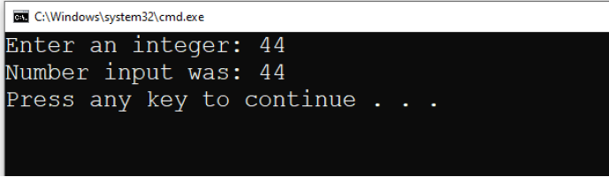

# Exercise 1
Write a program that contains an int variable. Ensure it compiles and runs successfully. Using the Scanner class, prompt the user to input a number, then output the number entered to the console.

- Write your code in the file `Exercise1.java`
- Following the guide below, create a program that has the following specification:
    - Import `java.util.Scanner`
    - Create an instance of the `Scanner` object:
    - Write Java statements that declare the following variable:
      - number1 of type `int`
    - Write Java statements that will prompt the user to enter an integer via the console
    - Write a Java statement that will output the number the user entered
    - The output should be similar to that shown below:

